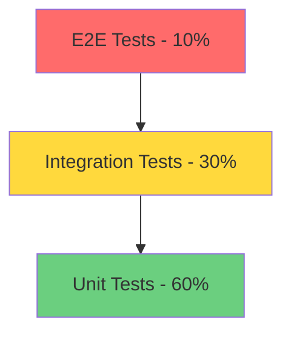

# TrollLLM Testing Architecture Plan

## Executive Summary

This document outlines a comprehensive testing strategy for TrollLLM, covering unit, integration, and end-to-end testing across all three services (Frontend, Backend, Go Proxy).

**Current State:** No tests implemented
**Target State:** 70%+ test coverage with automated CI/CD testing

---

## 1. Testing Infrastructure Overview

### 1.1 Testing Pyramid Strategy



### 1.2 Service-Specific Testing Breakdown

| Service | Unit Tests | Integration Tests | E2E Tests | Priority |
|---------|-----------|------------------|-----------|----------|
| **Backend** | 60% | 30% | 10% | **CRITICAL** |
| **Go Proxy** | 70% | 25% | 5% | **HIGH** |
| **Frontend** | 50% | 30% | 20% | **MEDIUM** |

---

## 2. Backend Testing Strategy (Node.js/Express)

### 2.1 Testing Framework Setup

**Recommended Stack:**
- **Test Runner:** Vitest (faster than Jest, native ESM support)
- **Assertion Library:** Vitest built-in (Jest-compatible)
- **Mocking:** Vitest mocks + MongoDB Memory Server
- **API Testing:** Supertest
- **Coverage:** c8 (built into Vitest)

**Alternative Stack (if Jest preferred):**
- Test Runner: Jest
- MongoDB: mongodb-memory-server
- API Testing: Supertest

### 2.2 Required Dependencies

```json
{
  "devDependencies": {
    "vitest": "^1.0.4",
    "supertest": "^6.3.3",
    "@vitest/coverage-c8": "^0.33.0",
    "mongodb-memory-server": "^9.1.3",
    "@types/supertest": "^2.0.16"
  }
}
```

### 2.3 Test Structure

```
backend/
├── src/
│   ├── controllers/
│   │   ├── auth.controller.ts
│   │   └── auth.controller.test.ts          # Unit tests
│   ├── services/
│   │   ├── payment.service.ts
│   │   └── payment.service.test.ts          # Unit tests
│   ├── repositories/
│   │   ├── user.repository.ts
│   │   └── user.repository.test.ts          # Unit tests
│   └── middleware/
│       ├── role.middleware.ts
│       └── role.middleware.test.ts          # Unit tests
├── tests/
│   ├── integration/
│   │   ├── api/
│   │   │   ├── auth.integration.test.ts    # API endpoint tests
│   │   │   ├── payment.integration.test.ts
│   │   │   ├── keys.integration.test.ts
│   │   │   └── proxy.integration.test.ts
│   │   └── database/
│   │       └── mongodb.integration.test.ts
│   ├── e2e/
│   │   ├── user-flow.e2e.test.ts           # Complete user journeys
│   │   └── payment-flow.e2e.test.ts
│   ├── fixtures/
│   │   ├── users.fixture.ts                # Test data
│   │   ├── payments.fixture.ts
│   │   └── keys.fixture.ts
│   ├── mocks/
│   │   ├── sepay.mock.ts                   # External service mocks
│   │   ├── paypal.mock.ts
│   │   └── mongodb.mock.ts
│   └── helpers/
│       ├── test-server.ts                   # Test server setup
│       ├── db-setup.ts                      # Database setup/teardown
│       └── auth.helper.ts                   # Auth utilities
├── vitest.config.ts                         # Vitest configuration
└── vitest.setup.ts                          # Global test setup
```

### 2.4 Critical Test Cases - Backend

#### 2.4.1 Authentication & Authorization
- [ ] User registration with validation
- [ ] Login with valid/invalid credentials
- [ ] JWT token generation and validation
- [ ] Token expiration handling
- [ ] Role-based access control (Admin vs User)
- [ ] API key validation (user keys, friend keys, factory keys)

#### 2.4.2 Payment System (**CRITICAL**)
```typescript
describe('PaymentService', () => {
  describe('createCheckout', () => {
    it('should create payment with valid credits amount', async () => {
      // Test credit validation (MIN_CREDITS to MAX_CREDITS)
    });
    
    it('should validate Discord ID format', async () => {
      // Test 17-19 digit Discord ID validation
    });
    
    it('should apply promo bonus when active', async () => {
      // Test promo code calculation
    });
  });
  
  describe('processWebhook', () => {
    it('should process valid SePay webhook', async () => {
      // Test webhook validation and credit addition
    });
    
    it('should reject duplicate webhook events', async () => {
      // Test idempotency
    });
    
    it('should handle amount mismatch', async () => {
      // Test payment amount validation
    });
  });
});
```

#### 2.4.3 Credit Management
- [ ] Credit deduction for API requests
- [ ] Credit expiration logic (7 days)
- [ ] RefCredits usage (fallback when main credits exhausted)
- [ ] Dual credit system (creditsNew for OpenHands, credits for OhMyGPT)

#### 2.4.4 API Key Management
- [ ] API key creation and revocation
- [ ] Key usage tracking
- [ ] Friend key validation with model limits
- [ ] Rate limiting per key type (User: 600 RPM, Friend: 60 RPM, Pro: 1000 RPM)

#### 2.4.5 Integration Tests - API Endpoints
```typescript
describe('POST /api/auth/login', () => {
  it('should return JWT token for valid credentials', async () => {
    const response = await request(app)
      .post('/api/auth/login')
      .send({ username: 'testuser', password: 'password123' })
      .expect(200);
    
    expect(response.body).toHaveProperty('token');
    expect(response.body).toHaveProperty('user');
  });
  
  it('should return 401 for invalid credentials', async () => {
    await request(app)
      .post('/api/auth/login')
      .send({ username: 'testuser', password: 'wrongpass' })
      .expect(401);
  });
});
```

---

## 3. Go Proxy Testing Strategy

### 3.1 Testing Framework Setup

**Recommended Stack:**
- **Test Framework:** Go standard `testing` package
- **Assertion Library:** `testify/assert` and `testify/mock`
- **HTTP Testing:** `httptest` (built-in)
- **Coverage:** `go test -cover`

### 3.2 Required Dependencies

```bash
go get github.com/stretchr/testify/assert
go get github.com/stretchr/testify/mock
go get github.com/stretchr/testify/suite
```

### 3.3 Test Structure

```
goproxy/
├── main.go
├── main_test.go                              # Main handler tests
├── internal/
│   ├── keypool/
│   │   ├── pool.go
│   │   └── pool_test.go                      # Unit tests
│   ├── proxy/
│   │   ├── pool.go
│   │   └── pool_test.go
│   ├── ratelimit/
│   │   ├── limiter.go
│   │   └── limiter_test.go
│   ├── maintarget/
│   │   ├── client.go
│   │   └── client_test.go
│   ├── openhands/
│   │   ├── provider.go
│   │   └── provider_test.go
│   └── ohmygpt/
│       ├── provider.go
│       └── provider_test.go
├── transformers/
│   ├── anthropic.go
│   └── anthropic_test.go
├── config/
│   ├── config.go
│   └── config_test.go
└── tests/
    ├── integration/
    │   ├── proxy_integration_test.go         # Integration tests
    │   └── mongodb_integration_test.go
    └── fixtures/
        ├── requests.json                      # Test request data
        └── responses.json
```

### 3.4 Critical Test Cases - Go Proxy

#### 3.4.1 Request Routing
```go
func TestSelectUpstreamConfig(t *testing.T) {
    tests := []struct {
        name           string
        modelID        string
        expectedType   string
        expectedKeyID  string
    }{
        {
            name:         "Claude Sonnet routes to main target",
            modelID:      "claude-sonnet-4-5-20250929",
            expectedType: "main",
            expectedKeyID: "main",
        },
        {
            name:         "Gemini routes to OpenHands",
            modelID:      "gemini-3-pro-preview",
            expectedType: "openhands",
            expectedKeyID: "openhands",
        },
    }
    
    for _, tt := range tests {
        t.Run(tt.name, func(t *testing.T) {
            config, _, err := selectUpstreamConfig(tt.modelID, "test-key")
            assert.NoError(t, err)
            assert.Equal(t, tt.expectedKeyID, config.KeyID)
        })
    }
}
```

#### 3.4.2 Rate Limiting
- [ ] Test rate limit enforcement per key type
- [ ] Test rate limit reset after window
- [ ] Test Pro RPM upgrade when using refCredits
- [ ] Test rate limit headers in response

#### 3.4.3 Request Transformation
- [ ] Test OpenAI to Anthropic format transformation
- [ ] Test thinking block handling
- [ ] Test system prompt injection
- [ ] Test blocked content sanitization

#### 3.4.4 Streaming Response Handling
- [ ] Test SSE event parsing
- [ ] Test usage tracking in streams
- [ ] Test error handling in mid-stream
- [ ] Test [DONE] marker handling

#### 3.4.5 Key Pool Management
```go
func TestKeyPoolRotation(t *testing.T) {
    pool := keypool.NewKeyPool()
    
    // Add test keys
    pool.AddKey("key1", "sk-test-1")
    pool.AddKey("key2", "sk-test-2")
    
    // Simulate budget exceeded error
    pool.CheckAndRotateOnError("key1", 402, "Budget exceeded")
    
    // Verify key1 is disabled
    assert.False(t, pool.IsKeyHealthy("key1"))
    
    // Verify key2 is still available
    assert.True(t, pool.IsKeyHealthy("key2"))
}
```

---

## 4. Frontend Testing Strategy (Next.js)

### 4.1 Testing Framework Setup

**Recommended Stack:**
- **Test Runner:** Vitest (faster, better DX with Vite)
- **Component Testing:** React Testing Library
- **E2E Testing:** Playwright (better than Cypress for Next.js)
- **Mocking:** MSW (Mock Service Worker)

### 4.2 Required Dependencies

```json
{
  "devDependencies": {
    "vitest": "^1.0.4",
    "@testing-library/react": "^14.1.2",
    "@testing-library/jest-dom": "^6.1.5",
    "@testing-library/user-event": "^14.5.1",
    "@playwright/test": "^1.40.0",
    "msw": "^2.0.0",
    "@vitest/ui": "^1.0.4",
    "jsdom": "^23.0.0"
  }
}
```

### 4.3 Test Structure

```
frontend/
├── src/
│   ├── app/
│   │   ├── dashboard/
│   │   │   ├── page.tsx
│   │   │   └── page.test.tsx                # Component tests
│   │   └── login/
│   │       ├── page.tsx
│   │       └── page.test.tsx
│   ├── components/
│   │   ├── KeyCard/
│   │   │   ├── KeyCard.tsx
│   │   │   └── KeyCard.test.tsx
│   │   └── PaymentForm/
│   │       ├── PaymentForm.tsx
│   │       └── PaymentForm.test.tsx
│   └── lib/
│       ├── api.ts
│       └── api.test.ts                       # API client tests
├── tests/
│   ├── e2e/
│   │   ├── auth.spec.ts                      # Playwright E2E tests
│   │   ├── payment.spec.ts
│   │   └── api-keys.spec.ts
│   ├── mocks/
│   │   ├── handlers.ts                       # MSW handlers
│   │   └── server.ts                         # MSW server setup
│   └── setup.ts                              # Global test setup
├── vitest.config.ts
├── playwright.config.ts
└── vitest.setup.ts
```

### 4.4 Critical Test Cases - Frontend

#### 4.4.1 Authentication Flow
```typescript
describe('Login Page', () => {
  it('should display login form', () => {
    render(<LoginPage />);
    expect(screen.getByLabelText(/username/i)).toBeInTheDocument();
    expect(screen.getByLabelText(/password/i)).toBeInTheDocument();
  });
  
  it('should submit login credentials', async () => {
    const user = userEvent.setup();
    render(<LoginPage />);
    
    await user.type(screen.getByLabelText(/username/i), 'testuser');
    await user.type(screen.getByLabelText(/password/i), 'password123');
    await user.click(screen.getByRole('button', { name: /login/i }));
    
    // Verify API call
    expect(mockLoginApi).toHaveBeenCalledWith({
      username: 'testuser',
      password: 'password123'
    });
  });
});
```

#### 4.4.2 Payment Component Testing
- [ ] Test credit amount validation
- [ ] Test Discord ID validation (17-19 digits)
- [ ] Test QR code generation
- [ ] Test payment status polling
- [ ] Test promo code application

#### 4.4.3 E2E User Flows (Playwright)
```typescript
test('complete user registration and first payment', async ({ page }) => {
  // 1. Register
  await page.goto('/register');
  await page.fill('[name="username"]', 'newuser');
  await page.fill('[name="password"]', 'SecurePass123!');
  await page.click('button[type="submit"]');
  
  // 2. Login
  await page.waitForURL('/login');
  await page.fill('[name="username"]', 'newuser');
  await page.fill('[name="password"]', 'SecurePass123!');
  await page.click('button[type="submit"]');
  
  // 3. Navigate to payment
  await page.waitForURL('/dashboard');
  await page.click('text=Buy Credits');
  
  // 4. Complete payment
  await page.fill('[name="credits"]', '20');
  await page.fill('[name="discordId"]', '123456789012345678');
  await page.click('button:has-text("Generate QR")');
  
  // 5. Verify QR code displayed
  await expect(page.locator('img[alt="QR Code"]')).toBeVisible();
});
```

---

## 5. Test Data Management

### 5.1 Fixtures Strategy

**Location:** `<service>/tests/fixtures/`

```typescript
// backend/tests/fixtures/users.fixture.ts
export const testUsers = {
  admin: {
    username: 'admin',
    password: 'admin123',
    role: 'admin',
    credits: 1000,
    creditsNew: 500,
  },
  regularUser: {
    username: 'user1',
    password: 'user123',
    role: 'user',
    credits: 100,
    creditsNew: 50,
  },
  expiredUser: {
    username: 'expired',
    password: 'expired123',
    role: 'user',
    credits: 0,
    expiresAt: new Date('2023-01-01'), // Past date
  },
};

// backend/tests/fixtures/payments.fixture.ts
export const testPayments = {
  validSepayWebhook: {
    id: 123456,
    gateway: 'MB Bank',
    transferAmount: 32000,
    content: 'TROLL20D12345ABC',
    transferType: 'in' as const,
    subAccount: 'VQRQAFRBD3142',
  },
  invalidAmountWebhook: {
    id: 123457,
    transferAmount: 10000, // Wrong amount
    content: 'TROLL20D12345ABC',
  },
};
```

### 5.2 Database Seeding

```typescript
// backend/tests/helpers/db-setup.ts
import { MongoMemoryServer } from 'mongodb-memory-server';
import mongoose from 'mongoose';

let mongod: MongoMemoryServer;

export async function setupTestDatabase() {
  mongod = await MongoMemoryServer.create();
  const uri = mongod.getUri();
  await mongoose.connect(uri);
}

export async function teardownTestDatabase() {
  await mongoose.connection.dropDatabase();
  await mongoose.connection.close();
  await mongod.stop();
}

export async function seedTestData() {
  // Seed users
  await User.create(testUsers.admin);
  await User.create(testUsers.regularUser);
  
  // Seed API keys
  await UserKey.create({
    _id: 'sk-test-user1',
    name: 'user1',
    tier: 'pro',
  });
}
```

---

## 6. Mocking Strategy

### 6.1 External Service Mocks

#### SePay Payment Gateway
```typescript
// backend/tests/mocks/sepay.mock.ts
export class MockSepayService {
  async verifyPayment(orderCode: string) {
    return {
      success: true,
      amount: 32000,
      transactionId: '123456',
    };
  }
  
  async createQRCode(amount: number, content: string) {
    return `https://mock-qr.example.com/qr?amount=${amount}&content=${content}`;
  }
}
```

#### MongoDB Mock
```typescript
// Use mongodb-memory-server for integration tests
import { MongoMemoryServer } from 'mongodb-memory-server';
```

### 6.2 Frontend API Mocking (MSW)

```typescript
// frontend/tests/mocks/handlers.ts
import { http, HttpResponse } from 'msw';

export const handlers = [
  http.post('/api/auth/login', async ({ request }) => {
    const { username, password } = await request.json();
    
    if (username === 'testuser' && password === 'password123') {
      return HttpResponse.json({
        token: 'mock-jwt-token',
        user: { username: 'testuser', role: 'user' },
      });
    }
    
    return new HttpResponse(null, { status: 401 });
  }),
  
  http.get('/api/keys', () => {
    return HttpResponse.json([
      { id: 'sk-test-1', name: 'Test Key 1', credits: 100 },
    ]);
  }),
];
```

---

## 7. Configuration Files

### 7.1 Backend Vitest Config

```typescript
// backend/vitest.config.ts
import { defineConfig } from 'vitest/config';

export default defineConfig({
  test: {
    globals: true,
    environment: 'node',
    setupFiles: ['./vitest.setup.ts'],
    coverage: {
      provider: 'c8',
      reporter: ['text', 'json', 'html'],
      exclude: [
        'node_modules/',
        'dist/',
        '**/*.test.ts',
        '**/*.spec.ts',
      ],
    },
    testTimeout: 10000,
  },
});
```

### 7.2 Frontend Vitest Config

```typescript
// frontend/vitest.config.ts
import { defineConfig } from 'vitest/config';
import react from '@vitejs/plugin-react';

export default defineConfig({
  plugins: [react()],
  test: {
    globals: true,
    environment: 'jsdom',
    setupFiles: ['./tests/setup.ts'],
    css: true,
  },
});
```

### 7.3 Playwright Config

```typescript
// frontend/playwright.config.ts
import { defineConfig, devices } from '@playwright/test';

export default defineConfig({
  testDir: './tests/e2e',
  fullyParallel: true,
  forbidOnly: !!process.env.CI,
  retries: process.env.CI ? 2 : 0,
  workers: process.env.CI ? 1 : undefined,
  reporter: 'html',
  use: {
    baseURL: 'http://localhost:8080',
    trace: 'on-first-retry',
  },
  projects: [
    {
      name: 'chromium',
      use: { ...devices['Desktop Chrome'] },
    },
  ],
  webServer: {
    command: 'npm run dev',
    url: 'http://localhost:8080',
    reuseExistingServer: !process.env.CI,
  },
});
```

---

## 8. CI/CD Pipeline

### 8.1 GitHub Actions Workflow

```yaml
# .github/workflows/test.yml
name: Test Suite

on:
  push:
    branches: [main, develop]
  pull_request:
    branches: [main, develop]

jobs:
  backend-tests:
    runs-on: ubuntu-latest
    steps:
      - uses: actions/checkout@v3
      
      - name: Setup Node.js
        uses: actions/setup-node@v3
        with:
          node-version: '18'
          
      - name: Install dependencies
        working-directory: ./backend
        run: npm ci
        
      - name: Run unit tests
        working-directory: ./backend
        run: npm test -- --coverage
        
      - name: Run integration tests
        working-directory: ./backend
        run: npm run test:integration
        
      - name: Upload coverage
        uses: codecov/codecov-action@v3
        with:
          files: ./backend/coverage/coverage-final.json
          
  goproxy-tests:
    runs-on: ubuntu-latest
    steps:
      - uses: actions/checkout@v3
      
      - name: Setup Go
        uses: actions/setup-go@v4
        with:
          go-version: '1.21'
          
      - name: Run tests
        working-directory: ./goproxy
        run: go test -v -race -coverprofile=coverage.out ./...
        
      - name: Upload coverage
        uses: codecov/codecov-action@v3
        with:
          files: ./goproxy/coverage.out
          
  frontend-tests:
    runs-on: ubuntu-latest
    steps:
      - uses: actions/checkout@v3
      
      - name: Setup Node.js
        uses: actions/setup-node@v3
        with:
          node-version: '18'
          
      - name: Install dependencies
        working-directory: ./frontend
        run: npm ci
        
      - name: Run unit tests
        working-directory: ./frontend
        run: npm test -- --coverage
        
      - name: Install Playwright
        working-directory: ./frontend
        run: npx playwright install --with-deps
        
      - name: Run E2E tests
        working-directory: ./frontend
        run: npm run test:e2e
        
      - name: Upload Playwright report
        if: always()
        uses: actions/upload-artifact@v3
        with:
          name: playwright-report
          path: frontend/playwright-report/
```

---

## 9. Testing Best Practices

### 9.1 General Guidelines

1. **Test Naming Convention:**
   - Descriptive: `should_return_error_when_credit_amount_invalid`
   - Use `describe` blocks for grouping related tests

2. **AAA Pattern (Arrange-Act-Assert):**
   ```typescript
   test('should deduct credits after request', async () => {
     // Arrange
     const user = await createTestUser({ credits: 100 });
     
     // Act
     await processRequest(user.id, { cost: 10 });
     
     // Assert
     const updatedUser = await getUser(user.id);
     expect(updatedUser.credits).toBe(90);
   });
   ```

3. **Test Independence:**
   - Each test should be independent
   - Use `beforeEach` to reset state
   - Clean up after tests in `afterEach`

4. **Mock External Dependencies:**
   - Don't call real payment APIs in tests
   - Use MongoDB Memory Server for database tests
   - Mock HTTP requests with MSW

### 9.2 Coverage Targets

| Category | Target | Priority |
|----------|--------|----------|
| **Critical Paths** (Payment, Auth) | 90%+ | MUST |
| **Business Logic** (Services) | 80%+ | MUST |
| **API Controllers** | 75%+ | HIGH |
| **Utilities** | 70%+ | MEDIUM |
| **UI Components** | 60%+ | MEDIUM |

---

## 10. Implementation Roadmap

### Phase 1: Foundation (Week 1-2)
- [ ] Install testing dependencies for all services
- [ ] Create configuration files
- [ ] Set up test helpers and fixtures
- [ ] Implement database test utilities

### Phase 2: Critical Backend Tests (Week 3-4)
- [ ] Payment service tests (PRIORITY 1)
- [ ] Authentication tests
- [ ] Credit management tests
- [ ] API key validation tests

### Phase 3: Go Proxy Tests (Week 5-6)
- [ ] Request routing tests
- [ ] Rate limiting tests
- [ ] Transformation logic tests
- [ ] Key pool management tests

### Phase 4: Integration Tests (Week 7-8)
- [ ] Backend API endpoint tests
- [ ] Go Proxy integration tests
- [ ] Database integration tests

### Phase 5: Frontend Tests (Week 9-10)
- [ ] Component unit tests
- [ ] E2E user flows (Playwright)
- [ ] API client tests

### Phase 6: CI/CD Integration (Week 11-12)
- [ ] GitHub Actions workflow
- [ ] Coverage reporting
- [ ] Pre-commit hooks
- [ ] Documentation

---

## 11. Testing Commands

### Backend
```bash
# Run all tests
npm test

# Run with coverage
npm test -- --coverage

# Run specific test file
npm test -- payment.service.test.ts

# Run in watch mode
npm test -- --watch

# Run integration tests only
npm run test:integration
```

### Go Proxy
```bash
# Run all tests
go test ./...

# Run with coverage
go test -cover ./...

# Run specific package
go test ./internal/keypool

# Run with race detection
go test -race ./...

# Generate coverage report
go test -coverprofile=coverage.out ./...
go tool cover -html=coverage.out
```

### Frontend
```bash
# Run unit tests
npm test

# Run with UI
npm run test:ui

# Run E2E tests
npm run test:e2e

# Run E2E in headed mode
npm run test:e2e -- --headed

# Generate coverage
npm test -- --coverage
```

---

## 12. Next Steps

1. **Review this architecture plan** with the team
2. **Prioritize critical tests** (Payment system first!)
3. **Set up testing infrastructure** (install dependencies, create configs)
4. **Start with high-value tests** (payment webhook, credit deduction)
5. **Gradually increase coverage** following the roadmap
6. **Integrate with CI/CD** to prevent regressions

---

## Appendix A: Test File Templates

### Backend Service Test Template
```typescript
// backend/src/services/__tests__/example.service.test.ts
import { describe, it, expect, beforeEach, afterEach } from 'vitest';
import { ExampleService } from '../example.service';
import { setupTestDatabase, teardownTestDatabase } from '../../tests/helpers/db-setup';

describe('ExampleService', () => {
  let service: ExampleService;
  
  beforeEach(async () => {
    await setupTestDatabase();
    service = new ExampleService();
  });
  
  afterEach(async () => {
    await teardownTestDatabase();
  });
  
  describe('methodName', () => {
    it('should do something when condition met', async () => {
      // Arrange
      const input = { /* test data */ };
      
      // Act
      const result = await service.methodName(input);
      
      // Assert
      expect(result).toBeDefined();
      expect(result.property).toBe('expected value');
    });
  });
});
```

### Go Test Template
```go
// goproxy/internal/example/example_test.go
package example

import (
    "testing"
    "github.com/stretchr/testify/assert"
)

func TestFunctionName(t *testing.T) {
    // Arrange
    input := "test input"
    
    // Act
    result := FunctionName(input)
    
    // Assert
    assert.NotNil(t, result)
    assert.Equal(t, "expected", result.Value)
}

func TestFunctionName_ErrorCase(t *testing.T) {
    // Arrange
    invalidInput := ""
    
    // Act
    result, err := FunctionName(invalidInput)
    
    // Assert
    assert.Error(t, err)
    assert.Nil(t, result)
}
```

---

**Document Version:** 1.0
**Last Updated:** 2026-01-11
**Author:** Architect Mode
**Status:** DRAFT - Awaiting Review